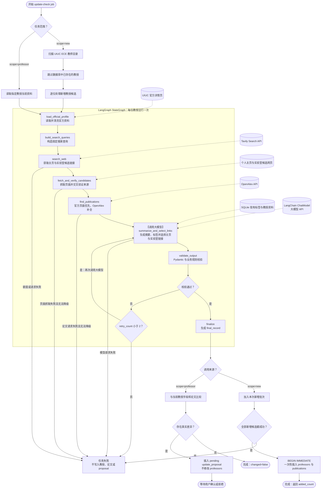

# Lab Application Tracker 设计规格

- 日期：2026-08-15
- 状态：对话设计已确认，书面规格待用户最终审阅
- 目标平台：个人本机、单用户、单进程
- 数据源：[UIUC ECE Department Faculty](https://ece.illinois.edu/about/directory/faculty-dept)

## 1. 产品目标

构建一个个人全栈 Web 应用，用于：

1. 收集 UIUC ECE 中仍在开展研究的教授。
2. 从官方教师页、教授主页、实验室主页和学术数据源提取研究信息。
3. 使用 LLM 将非结构化研究内容转换成摘要和自由标签。
4. 浏览、搜索和筛选教授。
5. 管理个人实验室申请状态、申请日期和笔记。
6. 只在用户明确检查单个教授并确认后，更新现有教授资料。

应用只在本机运行，不需要登录、多人隔离、云部署或定时任务。

## 2. 范围

### 2.1 MVP 包含

- React 教授列表页、教授详情页和单人更新确认页。
- FastAPI REST API。
- SQLite 持久化。
- UIUC ECE 教师目录采集。
- 对新教授的主页和实验室链接搜索。
- 研究内容抓取、清洗、LLM 摘要和标签生成。
- 最近三年最多五篇论文。
- “查找新教授”操作。
- 单个教授的差量检查、人工确认和拒绝。
- 申请状态、申请日期和单一文本笔记。

### 2.2 MVP 不包含

- 用户账户、权限或多人协作。
- 云端部署和跨设备同步。
- 定时或启动时自动抓取。
- 自动更新现有教授。
- 教授资料的手工编辑或覆盖。
- 状态变更历史、笔记版本或提醒日期。
- 标签管理后台。
- 独立的后台任务服务、Redis 或 Celery。
- 删除已离开 UIUC 目录的教授。

## 3. 核心产品规则

### 3.1 教授收录范围

系统只收录 tenure-track 或 research-active faculty。

目录筛选规则：

- 排除职称中含 `Teaching`、`Lecturer`、`Instructor`、`Emeritus` 或 `Adjunct` 的条目。
- 保留 Assistant Professor、Associate Professor、Professor 和 Research Professor 类条目。
- 对行政职称或非标准职称，只有当个人页包含当前研究领域、实验室或研究组证据时才收录。
- 无法可靠判断时跳过，不让 LLM 猜测研究活跃状态。

### 3.2 申请状态

合法状态只有：

```text
interested | applied | accepted | rejected
```

没有申请记录时，教授状态为空，界面显示 `—`。`Not tracked` 不是业务状态。

### 3.3 现有教授不可被批量更新

“查找新教授”只发现并添加数据库中不存在的教授：

- 不访问现有教授的研究来源。
- 不为现有教授调用搜索 API、OpenAlex 或 LLM。
- 不更新现有教授字段和论文。
- 不修改、删除或覆盖任何 pending proposal。
- 不修改申请状态、日期和笔记。

现有教授只能通过详情页中的“检查此教授”功能更新，并且必须由用户确认。

### 3.4 教授资料只读

用户不能手工修改抓取得到的姓名、职称、邮箱、主页、实验室、摘要、标签或论文。抓取错误只能通过重新检查该教授并确认新候选来修复。

## 4. 技术架构

### 4.1 技术栈

- 前端：JavaScript、React、Vite。
- 后端：Python、FastAPI、Pydantic。
- 数据库：SQLite，通过 Python 标准库 `sqlite3` 执行参数化原始 SQL；不使用 ORM。
- 数据库迁移：按编号排序的 `.sql` 文件和 SQLite `PRAGMA user_version`；不引入 Alembic。
- HTTP 与抓取：httpx、Beautiful Soup。
- 网页搜索：Tavily Search API，通过 `SearchProvider` 接口封装。
- 学术论文补全：OpenAlex API，通过 `PublicationProvider` 接口封装。
- LLM：LangChain ChatModel 负责模型调用和 Pydantic 结构化输出；默认使用 `langchain-openai` 的 `ChatOpenAI`。LangGraph `StateGraph` 负责研究增强流程。
- 前端测试：Vitest、React Testing Library、Playwright。
- 后端测试：pytest。

Tavily 的 Search endpoint 提供带 URL、标题、摘要和可选正文的搜索结果；OpenAlex 提供 Authors 和 Works 查询。实现只依赖本项目定义的 provider 接口，后续可以替换供应商而不修改业务层。

### 4.2 运行结构

开发环境分别运行 Vite 和 FastAPI。生产构建后，FastAPI 托管 Vite 生成的静态文件，用户只启动一个 Python 服务并访问本地 URL。

后端包含以下模块边界：

- `catalog`：教授、标签和论文查询。
- `applications`：申请记录读写。
- `discovery`：目录抓取、新教授识别和研究活跃判断。
- `research`：网页搜索、来源验证、页面抓取和正文清洗。
- `publications`：官方页面论文解析、OpenAlex 作者消歧和论文选择。
- `research_graph`：LangGraph 状态、节点、条件边、LangChain ChatModel 工厂、结构化输出和有限重试。
- `updates`：单人检查、字段比较、proposal 创建和应用。
- `jobs`：单进程内存任务状态。
- `repositories`：集中保存参数化原始 SQL，并把 `sqlite3.Row` 结果解析为 Pydantic 数据模型。

每个模块通过 service/repository 接口访问其他模块，路由层不直接执行抓取或 SQL。

### 4.3 原始 SQL 与迁移约束

- 统一连接工厂返回 `sqlite3.Connection`，并设置 `row_factory = sqlite3.Row`。
- 每个连接启用 `PRAGMA foreign_keys = ON`、`PRAGMA journal_mode = WAL` 和 `PRAGMA busy_timeout = 5000`。
- 所有外部输入通过 `?` 占位符绑定；禁止用 f-string、字符串拼接或模板插入 SQL 值。
- 动态排序字段只能从后端白名单映射为固定 SQL 片段，不能直接采用查询参数。
- 路由和 service 不拼装 SQL；每张表的查询集中在 repository 中，以便审查、测试和复用。
- 多步写操作使用显式事务；需要尽早获得写锁的流程使用 `BEGIN IMMEDIATE`，异常时完整回滚。
- 迁移文件命名为 `migrations/001_initial.sql`、`002_*.sql` 等。应用启动时读取 `PRAGMA user_version`，在事务中顺序执行尚未应用的脚本，并把 `user_version` 更新到对应版本。
- 不创建额外的 migration 元数据表，因此业务数据库仍只有第 8 节定义的四张表。

### 4.4 后台任务约束

- 同一时间最多运行一个抓取任务。
- FastAPI 必须以单 worker 运行。
- `job_id` 是应用层生成的 UUID 字符串。
- 实时任务状态只存于内存，不创建 `update_jobs` 表。
- 服务重启后正在运行的任务消失，旧 `job_id` 返回 404；数据库中已经提交的数据不受影响。

## 5. 外部服务与配置

本机 `.env` 保存：

```text
DATABASE_PATH=./data/lab_tracker.db
LLM_BASE_URL
LLM_API_KEY
LLM_MODEL
TAVILY_API_KEY
OPENALEX_API_KEY
```

`LLM_API_KEY`、`LLM_MODEL`、`TAVILY_API_KEY` 和 `OPENALEX_API_KEY` 必填；`LLM_BASE_URL` 只在使用符合 OpenAI API 规范的兼容端点时填写，使用官方 OpenAI 时留空。Tavily 和 OpenAlex 的 API key 都可以使用免费账户获取。`.env` 和 SQLite 数据文件必须加入 `.gitignore`。密钥不会传给前端、写入数据库或出现在日志中。

MVP 默认只使用免费额度，不启用自动付费或超额计费：

- Tavily Researcher 免费计划当前提供每月 1,000 API credits。发现流程默认使用 `search_depth="basic"`，每次搜索消耗 1 credit；只有证据不足时才允许升级为 `advanced`，其每次搜索消耗 2 credits。正文由本应用使用 httpx 抓取，不调用非必要的 Tavily Extract/Crawl 接口。
- OpenAlex 当前要求免费 API key，并为每个 key 提供每天 1 美元的免费用量。单条实体读取免费；list/filter 为每 1,000 次 0.10 美元，search 为每 1,000 次 1 美元。实现优先使用 author/works filter、字段选择、分页和缓存，避免重复搜索。
- 免费额度和价格属于外部服务配置，可能变化；上线实现前以供应商官方文档为准。
- 遇到额度耗尽或 429 时，任务以明确的 `EXTERNAL_QUOTA_EXCEEDED` 错误结束，不自动切换付费方案，也不写入部分数据。用户可在额度重置后重试。
- Tavily 和 OpenAlex 的免费额度不包含 LLM 调用费用；LLM 是否收费取决于用户配置的模型供应商。

## 6. 数据采集与 LLM 管线

### 6.1 LangGraph 编排

每位新教授或被单独检查的教授都运行同一个已编译 `StateGraph`。图负责研究资料的采集、工具调用、LLM 选择和校验，不直接写数据库。状态使用 `TypedDict` 定义，至少包含：

```text
professor_identity, official_profile, search_queries, search_results,
verified_pages, publication_candidates, existing_tags, llm_output,
validation_errors, retry_count, final_record
```

节点和主路径如下：

```text
load_official_profile
  -> build_search_queries
  -> search_web
  -> fetch_and_verify_candidates
  -> find_publications
  -> summarize_and_select_links
  -> validate_output
  -> finalize
```

- `load_official_profile`、查询模板构造、候选验证和最终规范化为确定性节点。
- `search_web` 通过 `SearchProvider` 调用 Tavily；`find_publications` 通过 `PublicationProvider` 调用 OpenAlex。
- `create_chat_model(settings)` 是一个薄工厂函数，返回 LangChain `BaseChatModel`；它只负责把模型名、API key、可选 `base_url`、超时和网络重试参数传给 `ChatOpenAI`，不再另行实现模型客户端封装类。
- `summarize_and_select_links` 是唯一需要 LLM 的节点。它调用 `model.with_structured_output(ProfessorResearchResult)`，直接获得经过 Pydantic 校验的结构化结果。
- 默认 `ChatOpenAI` 只依赖 OpenAI 标准字段。若以后使用具有专有响应字段的供应商，应改用该供应商的 LangChain integration，而不是继续扩展通用工厂。
- `validate_output` 执行业务规则校验；网络错误由 ChatModel 的有限重试处理，结构或业务校验失败则通过条件边最多返回 LLM 节点两次，之后结束为失败，禁止无限自主循环。
- 不使用 LangChain `create_agent` 或自由工具调用循环。搜索次数、工具顺序和停止条件均由显式 StateGraph 节点与边决定，从而控制费用并保证结果可测试。
- MVP 不启用 LangGraph checkpointer 或持久化。实时 job 仍由内存 `jobs` 模块管理；图成功返回并通过业务校验后，service 才开启 SQLite 事务。
- scope=new 对每位新增候选运行图并在全部成功后一次性写入；scope=professor 将图输出与当前记录比较并创建 proposal。

#### 6.1.1 教授信息获取流程图



虚线表示 LangGraph 节点读取的外部来源或现有上下文。图中只有标记为“调用大模型”的 `summarize_and_select_links` 节点会请求 LLM：正常情况下每位教授调用一次；Pydantic 或业务规则校验失败时最多再调用两次。Tavily 和 OpenAlex 是普通外部 API，其他 LangGraph 节点都是确定性 Python 逻辑。`finalize` 只生成经过验证的 `final_record`，不执行 SQL；真正的数据库写入发生在图外的 service 层。新增教授采用整批事务，单人检查只创建待确认 proposal。

### 6.2 教师目录发现

1. 请求 UIUC ECE Department Faculty 页面。
2. 提取姓名、职称和官方详情页 URL。
3. 规范化 URL，去除 fragment、无意义 query 参数和尾部斜杠差异。
4. 根据第 3.1 节规则筛选 research-active faculty。

### 6.3 新教授识别

按以下顺序判断目录条目是否已存在：

1. 规范化后的 `directory_profile_url` 完全匹配。
2. 官方详情页邮箱的小写值完全匹配。
3. 规范化姓名与 UIUC ECE 隶属关系同时匹配。

如果后两种规则命中多个教授，视为歧义并使本次新增操作失败，不创建重复记录。

### 6.4 主页和实验室链接发现

新教授或单人检查时执行：

1. 生成姓名、UIUC ECE、lab、research group、homepage 等搜索查询。
2. 通过 Tavily 获取候选 URL、标题、摘要和正文片段。
3. 优先 `illinois.edu` 域名，同时允许经过验证的 Google Sites、GitHub Pages 和个人域名。
4. 抓取候选页面，提取姓名、邮箱、单位和研究内容证据。
5. 将候选编号及证据交给 LLM；LLM 只能选择候选编号，不能生成新 URL。
6. 主页或实验室链接必须满足姓名匹配，并至少满足单位、邮箱或研究主题中的一项交叉验证。
7. 低置信度或无证据时保存空值，不猜测链接。

### 6.5 研究摘要和标签

输入为已经清洗并附带来源 URL 的研究页面文本。LangChain 使用 `with_structured_output(ProfessorResearchResult)` 要求 LLM 返回以下数据结构：

```json
{
  "research_summary": "string",
  "tags": ["string"],
  "selected_homepage_candidate_id": "string|null",
  "selected_lab_candidate_id": "string|null",
  "confidence": 0.0
}
```

规则：

- 摘要只陈述输入证据支持的研究内容。
- 标签由 LLM 自由生成，每位教授 3 至 6 个短标签。
- 管线向 LLM 提供数据库中的现有标签，要求优先复用但允许创建新标签。
- 标签保存前转为小写、压缩空白、去重并移除空字符串。
- Pydantic 解析或业务规则验证失败时，LangGraph 最多重新执行 LLM 节点两次；仍失败则整个教授处理失败。

### 6.6 论文选择

“最近三年”定义为当前年份及前两个自然年。例如 2026 年运行时只保留 2024–2026 年论文。

选择顺序：

1. 优先使用教授或实验室主页明确列出的论文。
2. 不足五篇时，使用 OpenAlex 补全。
3. OpenAlex 作者必须通过姓名和 University of Illinois Urbana-Champaign affiliation 消歧；无法唯一识别时不补全。
4. 官方页面论文按页面顺序优先，OpenAlex 补全论文按发表日期降序、引用数降序选择。
5. 使用 DOI，其次使用规范化标题、年份和教授 ID 去重。
6. 最终最多保存五篇。

## 7. 工作流

### 7.1 首次使用

数据库没有教授时，“查找新教授”将目录中全部符合条件的教授视为新教授，执行完整采集管线并写入数据库。

### 7.2 查找新教授

1. 用户在教授列表点击“Find new professors”。
2. 前端调用 `POST /api/update-checks`，scope 为 `new`。
3. 后端扫描目录并跳过全部现有教授。
4. 后端在写数据库前完成所有新教授的数据收集和校验。
5. 所有新教授在一个 SQLite 事务中写入；任一新增教授处理失败时不写入任何新教授。
6. 前端静默轮询任务，不显示独立页面、进度条、已有教授或新增教授明细。
7. 成功后刷新教授列表：
   - 添加数量大于零：显示“新增成功：已添加 N 位教授”。
   - 没有新教授：显示“查找成功：没有新教授”。
8. 失败时显示“新增失败：数据库未发生变化”。

### 7.3 检查单个教授

1. 用户在教授详情页点击“Check this professor”。
2. 如果该教授已经存在 pending proposal，按钮禁用，API 返回 409 并返回现有 `proposal_id`。
3. 如果其他任务正在运行，API 返回 409。
4. 后端重新获取该教授来源并计算标准化内容哈希。
5. 哈希未变化时不调用 LLM，不创建 proposal，返回“没有变化”。
6. 哈希变化时运行搜索、抓取、论文和 LLM 管线。
7. 与当前数据库值比较；只有真实字段差异才创建 pending proposal。
8. 用户在差异页查看 current/proposed 值、论文差异、来源和置信度。
9. 用户只能整体应用或整体拒绝，不能逐字段选择。

### 7.4 应用单人更新

应用 proposal 时，在一个事务中：

1. 锁定并再次验证 proposal 仍为 pending。
2. 更新教授字段。
3. 替换该教授的论文集合。
4. 将 proposal 标记为 applied 并设置 `resolved_at`。

`application_status` 永远不参与该事务的更新部分。拒绝 proposal 只把状态改为 rejected。

## 8. 数据库设计

### 8.1 `professors`

| 字段 | 类型与约束 | 说明 |
|---|---|---|
| `id` | INTEGER PK | 本地主键 |
| `name` | TEXT NOT NULL | 姓名 |
| `title` | TEXT NOT NULL | 职称 |
| `email` | TEXT NULL | 邮箱 |
| `directory_profile_url` | TEXT NOT NULL UNIQUE | 官方目录页及主要外部标识 |
| `homepage_url` | TEXT NULL | 个人主页 |
| `lab_url` | TEXT NULL | 实验室或研究组主页 |
| `research_summary` | TEXT NOT NULL | LLM 摘要 |
| `tags_json` | TEXT NOT NULL DEFAULT `'[]'` | 自由标签 JSON 数组 |
| `source_urls_json` | TEXT NOT NULL DEFAULT `'[]'` | 来源 URL JSON 数组 |
| `source_hash` | TEXT NOT NULL | 标准化来源内容 SHA-256 |
| `created_at` | DATETIME NOT NULL | 首次加入时间 |
| `last_checked_at` | DATETIME NOT NULL | 最近检查时间 |
| `updated_at` | DATETIME NOT NULL | 最近资料更新时间 |

对 `lower(email)` 和规范化姓名建立普通索引，用于重复检测；邮箱不设 UNIQUE，因为它可以为空或被网站复用。

### 8.2 `application_status`

| 字段 | 类型与约束 | 说明 |
|---|---|---|
| `id` | INTEGER PK | 主键 |
| `professor_id` | INTEGER NOT NULL UNIQUE FK | 一位教授最多一条申请记录 |
| `state` | TEXT NOT NULL CHECK | 四种合法状态 |
| `application_date` | DATE NULL | 唯一业务日期 |
| `notes` | TEXT NOT NULL DEFAULT `''` | 单一文本笔记 |
| `updated_at` | DATETIME NOT NULL | 最近编辑时间 |

外键使用 `ON DELETE CASCADE`，但 MVP 不提供删除教授的 API。

### 8.3 `publications`

| 字段 | 类型与约束 | 说明 |
|---|---|---|
| `id` | INTEGER PK | 主键 |
| `professor_id` | INTEGER NOT NULL FK | 所属教授 |
| `title` | TEXT NOT NULL | 论文标题 |
| `year` | INTEGER NOT NULL | 发表年份 |
| `venue` | TEXT NULL | 期刊或会议 |
| `publication_url` | TEXT NULL | 论文链接 |
| `doi` | TEXT NULL | DOI |
| `source` | TEXT NOT NULL | `faculty_page`、`lab_page` 或 `openalex` |
| `created_at` | DATETIME NOT NULL | 写入时间 |

唯一约束：`UNIQUE(professor_id, title, year)`。外键使用 `ON DELETE CASCADE`。

### 8.4 `update_proposals`

该表只用于单个教授更新，“查找新教授”不写入此表。

| 字段 | 类型与约束 | 说明 |
|---|---|---|
| `id` | INTEGER PK | `proposal_id` |
| `job_id` | TEXT NOT NULL | 创建它的内存任务 UUID，不是外键 |
| `professor_id` | INTEGER NOT NULL FK | 被检查教授 |
| `status` | TEXT NOT NULL CHECK | pending/applied/rejected/failed |
| `old_values_json` | TEXT NULL | 当前字段快照 |
| `new_values_json` | TEXT NULL | 候选字段快照 |
| `publication_diff_json` | TEXT NULL | 新增和移除论文 |
| `source_urls_json` | TEXT NOT NULL DEFAULT `'[]'` | 候选来源 |
| `confidence` | REAL NULL CHECK | 0 到 1 |
| `error_message` | TEXT NULL | 失败原因 |
| `created_at` | DATETIME NOT NULL | 创建时间 |
| `resolved_at` | DATETIME NULL | 应用或拒绝时间 |

部分唯一索引保证每位教授最多一个 pending proposal：

```sql
CREATE UNIQUE INDEX uq_pending_proposal_per_professor
ON update_proposals(professor_id)
WHERE status = 'pending';
```

### 8.5 关系

```text
professors 1 ─── 0..1 application_status
professors 1 ─── N publications
professors 1 ─── N update_proposals
```

不创建 `tags`、`professor_tags`、`users`、`notes`、`application_events` 或 `update_jobs` 表。

## 9. REST API

所有 API 使用 `/api` 前缀和 JSON。错误格式统一为：

```json
{
  "error": {
    "code": "PENDING_UPDATE_EXISTS",
    "message": "This professor already has a pending update.",
    "details": {"proposal_id": 101}
  }
}
```

### 9.1 系统

#### `GET /api/health`

检查 FastAPI 和 SQLite 是否可用。

### 9.2 教授查询

#### `GET /api/professors`

查询参数：

```text
q, tags, state, page, page_size, sort, order
```

- `q` 搜索姓名、职称、邮箱和标签。
- `tags` 使用逗号分隔，采用任一标签匹配。
- `state` 只允许四种申请状态；不传时包含无申请记录的教授。
- 默认 `page=1`、`page_size=25`、`sort=name`、`order=asc`。

#### `GET /api/professors/{professor_id}`

返回完整教授资料、论文、申请记录和 pending proposal ID。

#### `GET /api/tags`

从 `professors.tags_json` 聚合标签及教授数量，供列表筛选器使用。

### 9.3 申请管理

#### `PUT /api/professors/{professor_id}/application`

幂等创建或整体更新 state、application_date 和 notes。

#### `DELETE /api/professors/{professor_id}/application`

删除申请记录，使列表状态恢复为空。

### 9.4 启动任务

#### `POST /api/update-checks`

查找新教授：

```json
{"scope": "new"}
```

检查单个教授：

```json
{"scope": "professor", "professor_id": 123}
```

返回 `202 Accepted` 和 UUID `job_id`。已有任务运行时返回 `409 UPDATE_ALREADY_RUNNING`；单人已有 pending 时返回 `409 PENDING_UPDATE_EXISTS`。

#### `GET /api/update-checks/{job_id}`

返回 queued/running/completed/failed 状态。

- scope=new 时，前端静默轮询，仅使用最终 `added_count` 或错误显示通知并刷新列表。
- scope=professor 时，完成响应返回 `proposal_id` 或 `changed=false`。
- 服务重启后未知 job 返回 404。

### 9.5 单人更新候选

#### `GET /api/update-proposals`

支持 `status`、`professor_id`、`page` 和 `page_size`，用于详情页恢复 pending 状态和查询审计记录。

#### `GET /api/update-proposals/{proposal_id}`

返回字段级和论文差异、来源与置信度。

#### `POST /api/update-proposals/{proposal_id}/apply`

事务性应用仍为 pending 的 proposal；否则返回 409。

#### `POST /api/update-proposals/{proposal_id}/reject`

将仍为 pending 的 proposal 标记为 rejected；否则返回 409。

常用 HTTP 状态：400 参数错误、404 不存在、409 状态冲突、422 schema 校验错误、500 内部错误、502 外部服务失败。

## 10. UI 与交互

### 10.1 应用外观

- 使用 Illinois Block I 标识和克制的蓝橙品牌色。
- 桌面以高密度列表为主；窄屏将表格行重排为卡片式信息块。
- 所有按钮、输入框和通知支持键盘操作和可见焦点。

### 10.2 教授列表页

列：姓名、职称、邮箱、实验室链接、标签、状态。

功能：

- 搜索姓名、职称、邮箱和标签。
- 标签筛选。
- 四种申请状态筛选。
- 分页。
- 点击姓名进入详情页。
- 顶部“Find new professors”按钮。

点击查找按钮后仍停留在列表页，不显示独立任务页或进度条。成功后刷新列表并显示成功通知；失败只显示失败通知。

### 10.3 教授详情页

显示：

- 姓名、职称、邮箱、个人主页和实验室链接。
- 自由研究标签。
- 研究摘要。
- 最近论文。
- 来源链接和最近检查时间。
- 申请状态、申请日期和单一文本笔记。
- “Check this professor”按钮。

申请表单使用显式保存。已有 pending proposal 时，检查按钮禁用并替换为“查看待确认更新”。

### 10.4 更新差异页

- current 和 proposed 并排展示。
- 显示摘要、标签、链接和论文差异。
- 显示来源和置信度。
- 明确说明申请信息不受影响。
- 只提供“Apply update”和“Reject update”，不允许逐字段应用。

## 11. 错误处理与数据安全

### 11.1 外部请求

- 为目录、搜索、网页、OpenAlex 和 LLM 分别设置连接与总超时。
- 超时和 5xx 最多重试三次，使用指数退避和抖动。
- 429 先读取供应商的限流响应；短时速率限制可以按 `Retry-After` 有限重试，明确的日/月额度耗尽不重试并返回 `EXTERNAL_QUOTA_EXCEEDED`。
- 4xx 配置错误不自动重试。
- 限制并发，避免对 UIUC 或个人站点造成高请求压力。
- 设置清晰的 User-Agent 和联系邮箱。
- Tavily 查询和 OpenAlex 作者解析结果按规范化查询缓存，单次 job 内不重复计费请求。

### 11.2 新教授原子性

“查找新教授”在收集和验证全部新教授后才打开写事务。任何新教授的必需字段、LLM schema 或唯一性校验失败，都回滚本次所有新增，现有数据库保持不变。

### 11.3 单人更新安全

- 抓取和 LLM 阶段不修改当前教授。
- proposal 应用前重新检查状态。
- 教授与论文在同一事务中更新。
- 任何异常回滚事务，proposal 保持 pending 或记录 failed。
- 更新服务没有写 `application_status` 的 repository 权限。

### 11.4 日志

- 使用结构化本地日志记录 job_id、professor_id、阶段、耗时和错误代码。
- 不记录 API key、完整 LLM prompt 或用户笔记。
- 日志只用于本机诊断，不发送遥测。

## 12. 测试策略

### 12.1 后端单元测试

- URL、邮箱和姓名规范化。
- research-active 职称筛选。
- 新教授重复检测和歧义处理。
- 标签规范化与去重。
- LangChain ChatModel 工厂的官方 OpenAI 与自定义 `base_url` 配置。
- 使用 fake `BaseChatModel`/Runnable 测试 LangGraph，不在测试中访问真实 LLM。
- LangGraph 节点状态转换、条件边、Pydantic 结构化输出和最多两次业务重试。
- 确认图中没有自由 agent 循环，工具调用次数受确定路径和重试上限约束。
- 外部额度耗尽直接失败且不进入数据库写入阶段。
- 作者消歧与论文三年窗口。
- 论文去重和最多五篇规则。
- source hash 和字段差异计算。
- proposal 状态机。

### 12.2 抓取测试

- 使用版本化 HTML fixture，不在常规测试中访问真实网站。
- 覆盖目录结构变化、缺少邮箱、无实验室链接、页面超时和导航噪声。
- 搜索、OpenAlex 和 LLM 全部使用可预测 mock。

### 12.3 数据库与 API 集成测试

- 使用临时 SQLite 数据库执行编号 `.sql` migration，并验证 `PRAGMA user_version` 可从空库顺序升级。
- 验证 repository 只使用绑定参数，恶意搜索、筛选和排序输入不能改变 SQL 结构。
- 验证连接启用外键、WAL 和 busy timeout，多步写入失败时事务完整回滚。
- 验证四张表的外键、CHECK 和唯一约束。
- scope=new 只插入新教授且失败时整体回滚。
- scope=new 不调用现有教授的搜索、OpenAlex 或 LLM mock。
- 单人 pending 唯一索引和重复点击 409。
- 同时只能运行一个任务。
- apply/reject 的事务性和幂等冲突。
- 所有教授更新路径均保持 application_status 不变。

### 12.4 前端测试

- 列表搜索、标签和状态筛选。
- 无申请记录显示 `—`。
- 查找新教授期间无进度页或进度条。
- 新增成功刷新列表并显示成功通知。
- 新增失败不刷新数据并显示失败通知。
- pending 时禁用单人检查按钮。
- 申请表单保存和删除。
- 差异页 current/proposed、应用和拒绝流程。

### 12.5 端到端验收

1. 空数据库首次导入后可以浏览教授。
2. 再次查找时所有现有教授被跳过且数据完全不变。
3. 模拟目录新增一位教授后，只新增该教授及论文。
4. 单人内容发生变化时生成 proposal，未确认前数据库不变。
5. 应用 proposal 后教授和论文更新，申请记录保持原值。
6. 拒绝 proposal 后教授数据保持原值，可以再次检查。
7. 外部服务失败时界面给出简洁错误，SQLite 不出现部分写入。
8. 模拟 Tavily 或 OpenAlex 免费额度耗尽时，界面提示稍后重试且不会发起付费请求。

## 13. 成功标准

- 用户能在一个本机命令启动应用。
- 教授列表可搜索并按自由标签和申请状态筛选。
- 教授详情包含要求的联系方式、链接、摘要、标签和近期论文。
- 用户能维护四种状态、一个申请日期和一个文本笔记。
- “查找新教授”永远不修改现有教授，并且只显示最终成功或失败通知。
- 现有教授只有经过单人检查和用户确认才会改变。
- 抓取或 LLM 失败不会破坏现有教授或申请数据。
- 应用不依赖 ORM；schema 可由原始 SQL migration 从空 SQLite 数据库完整重建。
- Tavily 和 OpenAlex 默认限制在免费额度内，额度耗尽时安全失败而不自动付费。

## 14. 参考资料

- [UIUC ECE Department Faculty](https://ece.illinois.edu/about/directory/faculty-dept)
- [Illinois Block I Logo Guidelines](https://brand.illinois.edu/visual-identity/logo)
- [Tavily Search API](https://docs.tavily.com/documentation/api-reference/endpoint/search)
- [Tavily API Credits](https://docs.tavily.com/documentation/api-credits)
- [LangChain Models](https://docs.langchain.com/oss/python/langchain/models)
- [LangChain Structured Output](https://reference.langchain.com/python/langchain-openai/chat_models/base/ChatOpenAI/with_structured_output)
- [LangGraph Graph API](https://docs.langchain.com/oss/python/langgraph/graph-api)
- [OpenAlex API Overview](https://developers.openalex.org/api-reference/introduction)
- [OpenAlex Authentication and Pricing](https://developers.openalex.org/api-reference/authentication)
- [OpenAlex Deprecations](https://developers.openalex.org/guides/deprecations)
- [OpenAlex Authors](https://developers.openalex.org/api-reference/authors)
- [OpenAlex Works](https://developers.openalex.org/api-reference/works/list-works)
