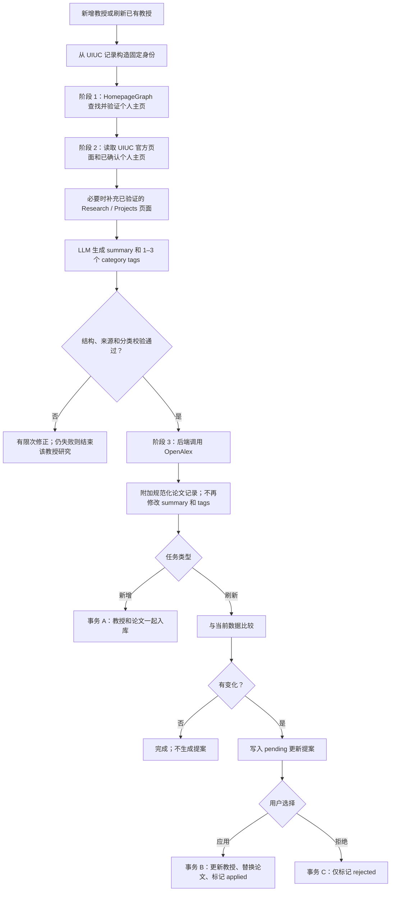
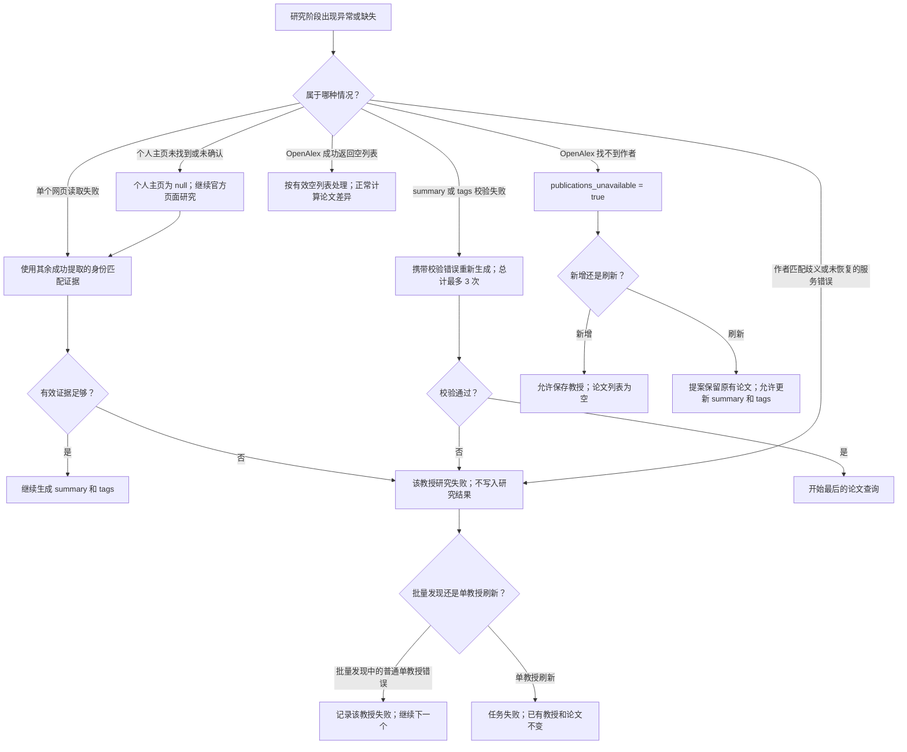
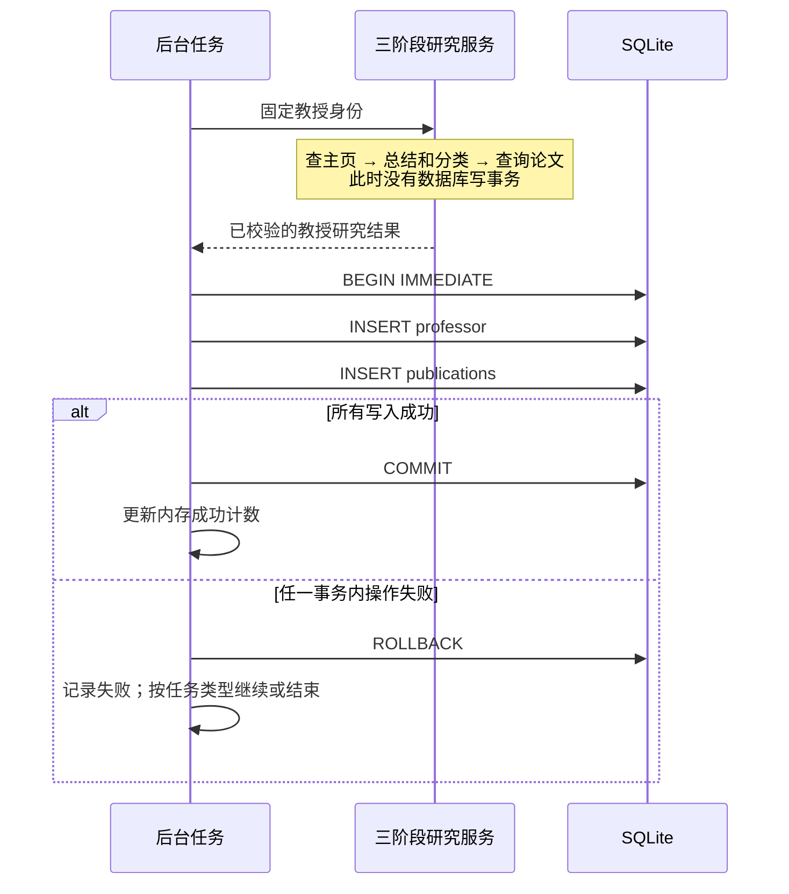
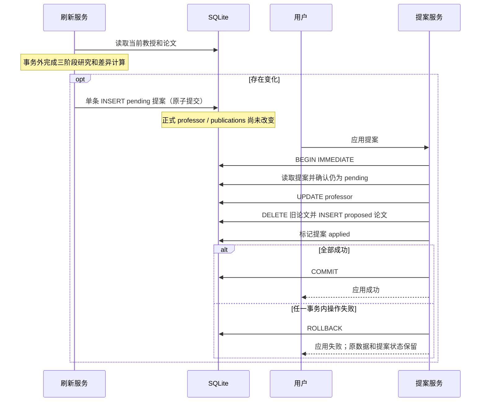

# Homepage-first professor research

## Objective

For both newly discovered professors and existing-professor refreshes, run personal homepage discovery first, generate the research summary and category tags from verified website evidence second, and retrieve publications last. The user explicitly selected this ordering in the design discussion.

## Approach

Use explicit backend orchestration of three sequential stages. Prompt-only ordering leaves publication timing to the model and is insufficient. A single combined graph could enforce the same sequence, but would unnecessarily couple the existing homepage and research graphs. Reuse those components with a smaller research graph and a final deterministic publication lookup.

## Stage 1: Find the personal homepage

Construct the fixed professor identity from the UIUC faculty record. Run HomepageGraph before ProfessorResearchGraph. Keep its existing behavior: inspect the official UIUC page, follow a personal homepage link or search if needed, read the target, and verify identity. An unconfirmed homepage remains null.

Register the confirmed personal homepage as a research evidence candidate alongside the official UIUC profile. Discovery currently returns a URL, so registration alone must not count as extracted evidence: the research stage must read the page through its verified page extraction path.

## Stage 2: Summarize website evidence and classify

Attempt extraction of the official UIUC page and the confirmed personal homepage before research finalization. Feed successfully extracted, identity-checked content to the research graph. Relevant Research or Projects pages may supply additional evidence within existing tool budgets. Count pre-extracted pages toward the unique-page budget and avoid fetching them again within that stage.

Generate research_summary and 1–3 exact category tags from the existing controlled taxonomy. Preserve source-ID validation and cite the supporting pages. Do not introduce a new taxonomy or infer research directions from OpenAlex data. Website publication sections can remain part of page text, but structured publication retrieval happens only in stage 3.

Remove get_recent_publications from the research agent's tool set, publication selection from its structured finalizer contract, and OpenAlex data from its prompt/state. Keep the domain-level validated result capable of carrying publications after stage 3.

If no personal homepage is confirmed, use the official page and other verified research evidence. If one page cannot be extracted, use the available verified evidence; if reliable research evidence is insufficient, fail validation rather than invent a summary or category.

Preserve the current UI field mapping for the discovered personal website to avoid an unrelated frontend/schema migration.

## Stage 3: Retrieve publications

After summary and category validation succeeds, call the identity-bound OpenAlex provider from the backend. Retain its existing author matching, date window, newest-first limit of 25, normalization, and deduplication. Attach all provider-returned normalized records directly; no LLM publication selection is needed.

Remove the earlier publication preload from the refresh path. Both entry points follow the same stage ordering. Provider cache expiration is a separate issue and is not changed by this ordering refactor.

Preserve existing error behavior: an author-not-found result marks publications unavailable and allows the run to finish; existing-professor proposals retain previous publications in that case. A successful empty result remains a valid empty collection. Other provider errors retain their current handling.

## Persistence

Persist a new professor and publications in the existing transaction after all stages finish. For an existing professor, generate the existing update proposal and retain the explicit apply workflow. This change does not introduce intermediate database writes.

## 主流程图

下图描述已实现的流程。新增和刷新共用三个研究阶段；论文查询必须在 summary 和 tags 校验通过后开始。

数据依赖是单向的：`网站证据 → summary / tags → 附加论文 → 持久化`。论文结果不回流到本轮 summary / tags 生成过程。网站中的 Publications 栏目可以作为网页内容被读取，但不会触发提前调用 OpenAlex。

## 异常处理图

异常语义与边界：

| 情况 | 处理 | 对数据库的影响 |
|---|---|---|
| 个人主页正常返回 null | 使用官方页面等有效证据 | 不单独存储未完成研究 |
| 网页工具失败或页面无法验证 | 在现有预算内使用其他证据 | 证据不足则不入库、不生成提案 |
| finalizer 输出结构、来源或分类不合法 | 最多 3 次生成尝试，包含第一次 | 全部失败则不进入论文步骤 |
| LLM 服务异常等未被组件恢复的异常 | 向上报告；不一律当作“没有主页” | 本轮研究不落库 |
| OpenAlex 作者不存在 | 标记 unavailable，继续 | 新增可存空论文；刷新保留旧论文 |
| OpenAlex 查询成功但没有论文 | 接受有效空结果 | 刷新可能提出删除旧论文，需用户应用才生效 |
| OpenAlex 作者歧义、HTTP 错误等未恢复异常 | 该教授研究失败 | 尚未入库的 summary 和 tags 不做部分保存 |
| 目录发现失败或既有 job-level 错误 | 按现有 job 规则结束任务 | 已经提交的其他教授不回滚 |
| 写入失败、外键或唯一约束冲突 | 回滚当前写事务并报告错误 | 不回滚其他已提交事务 |

本次不增加无限重试或新的 provider 重试策略。内存 job 状态与 SQLite 数据不是同一事务；重启后 job 进度可能丢失，已提交记录仍保留。

## 事务规划与边界

**网络请求和 LLM 调用全部放在数据库写事务之外。** 三个研究阶段完成后，先构造并校验待写入对象，再开启短事务。不能在持有 SQLite 写锁时等待网页、模型或 OpenAlex。

沿用当前 SQLite `WAL`、外键检查和 5 秒 busy timeout；显式事务通过 `transaction()` 默认执行 `BEGIN IMMEDIATE`，事务体异常时回滚。不对整批教授开启一个大事务，也不引入嵌套事务。

| 写入单元 | 开始时机与事务内操作 | 提交后的结果 | 失败后的结果 |
|---|---|---|---|
| A：新增一个教授 | 研究完成后 BEGIN；插入 professor；批量插入其 publications；COMMIT | 教授及本次论文一起可见 | 全部回滚，不留只有教授或部分论文的记录 |
| 生成更新提案 | 网络阶段结束后比较差异；有变化时执行一次 INSERT，完整写入 old/new values 和 publication diff | 新增 pending 提案，正式教授数据不变 | INSERT 失败不留下半份提案；已有 pending 冲突按现有规则返回 |
| B：应用提案 | BEGIN；读取并校验 pending；更新 professor；删除旧论文并插入 proposed 论文；标记 applied；COMMIT | 正式数据与提案状态同步更新 | 全部回滚：旧教授、旧论文以及 pending 状态保持原样 |
| C：拒绝提案 | BEGIN；读取并校验 pending；标记 rejected；COMMIT | 仅提案状态变化 | 回滚，提案仍为 pending |

生成提案当前是自动提交模式下的单条 INSERT，SQLite 为该语句提供原子性；不能把它描述成已经实现了“读取当前数据、比较差异、写提案”的完整显式事务。现有唯一约束限制每位教授最多一个 pending 提案。本次沿用该边界，不新增版本号或并发旧快照检测；若未来允许其他入口并发修改同一教授，需另行增加版本校验以防覆盖新数据。

### 新增教授的事务时序

### 更新提案的事务时序

其中，`publications_unavailable` 在**构造提案时**就将 proposed 论文设为旧论文集合，因此应用提案时使用统一的替换流程也不会误删旧论文。有效空结果则生成空的 proposed 集合，只有用户应用后才会删除旧论文。

提交完成后才更新内存 job 计数。若数据库已提交、进度更新前进程崩溃，不能声称数据已回滚；重新发现依靠既有身份匹配和数据库约束避免重复，应用同一提案则通过 pending 状态检查阻止重复执行。

## Validation

- Assert stage order for new and refresh paths: homepage discovery, website evidence and summary validation, then publication lookup.
- Assert both available target pages are attempted and supplied as extracted evidence before finalization.
- Assert the research agent cannot call the publication tool and receives no OpenAlex records.
- Assert category/source validation still rejects unsupported values and unknown IDs.
- Assert publications attach after summarization without changing the summary or tags.
- Assert homepage-null and one-page-unavailable fallbacks, insufficient-evidence failure, author-not-found preservation, and successful empty publication comparison.
- Run affected research/provider/orchestration tests and existing new-professor and proposal integration checks; update development documentation to describe the enforced sequence.
- Verify new-professor rollback when publication insertion fails, and proposal-apply rollback when insertion or status transition fails, including preservation of the pending status.
- Verify duplicate pending proposals and repeated apply/reject requests respect existing constraints; assert no external provider call executes within a write transaction.

## Review status

Implemented on 2026-09-13. New and refresh paths now discover the personal homepage first, preload official/personal webpage evidence into the research graph, validate the summary and controlled categories, and retrieve publications last. The research model no longer receives publication data or selects publication IDs. Database transaction boundaries remain unchanged.

Validation: 135 backend tests passed, including stage ordering, both-page evidence delivery, page-budget accounting, fallback behavior, missing-author preservation, and proposal rollback after publication deletion or before the applied-state transition. Ruff checks passed. Tests use deterministic providers; no live external API or model request was made, and no existing professor data was refreshed as part of this change.
